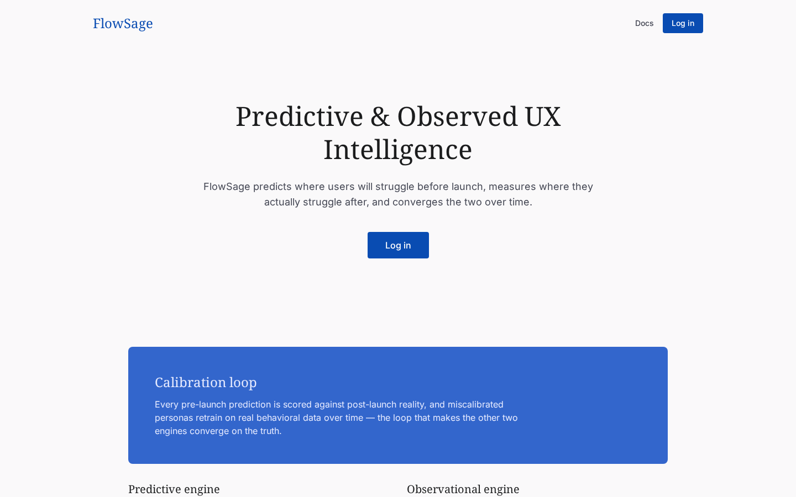
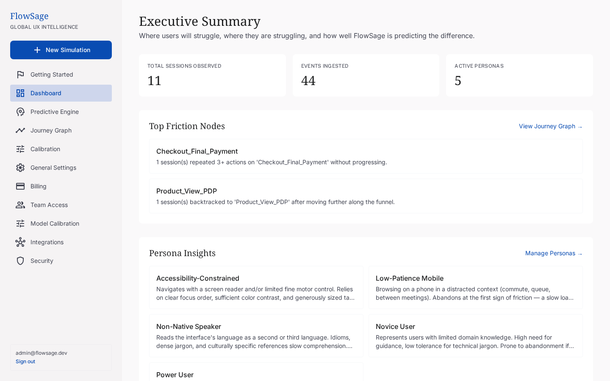
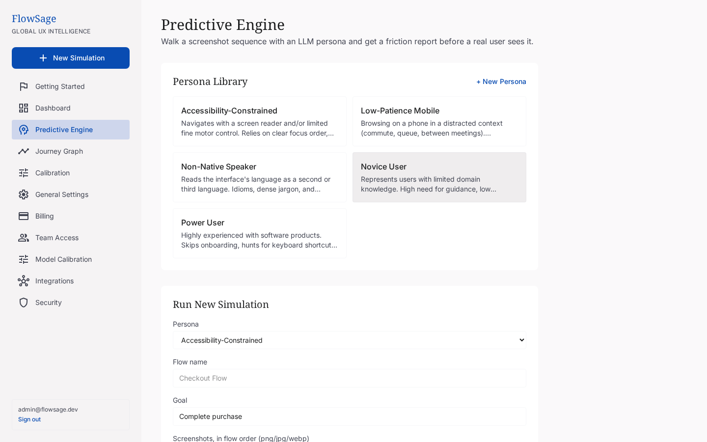
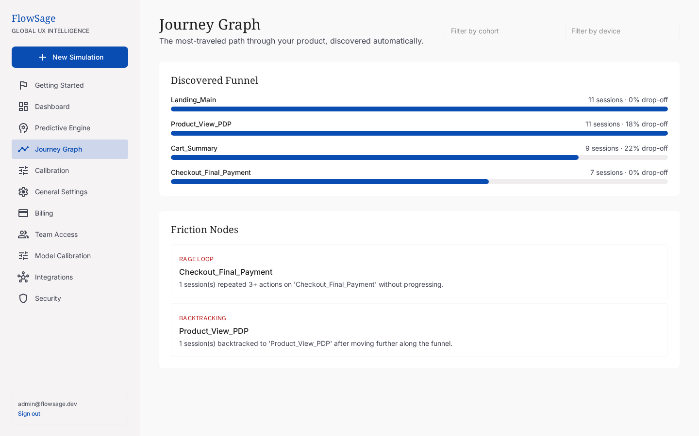

# FlowSage

**Predictive & Observed UX Intelligence Platform**

[](https://github.com/Ali-Razmdideh/FlowSage/actions/workflows/ci.yml)
[](LICENSE)

FlowSage merges two halves of UX analytics that usually live in separate tools: predicting where users will struggle before launch, and measuring where they actually struggle after — then scores its own predictions against reality and improves over time.

- **Predictive engine** — multimodal LLM personas walk a product's UI (screenshots, Figma frames, or a live staging URL) and produce a structured friction report before a single real user touches the flow.
- **Observational engine** — real user event streams are modeled as a temporal graph in Neo4j and Postgres; every screen and transition becomes a funnel step, surfacing where journeys stall, loop, or die.
- **Calibration loop** — predicted friction is matched against observed friction, personas are scored for accuracy, and miscalibrated ones are nudged and retrained on real behavioral data.

## Screenshots

| | |
|---|---|
|  |  |
|  |  |

## Features

**Predictive engine**
- Configurable LLM personas (novice, power user, accessibility-constrained, low-patience mobile, non-native speaker), each with its own behavioral sliders and memory bank
- Runs against a screenshot sequence (CLI, web upload, or the Figma plugin's export-and-annotate round trip)
- Friction reports with severity, heuristic violated, persona impact, and a suggested fix per screen

**Observational engine (Journey Graph)**
- SDK/webhook-style ingestion (`POST /v1/events`) into an automatically discovered funnel — no manual funnel definitions
- Friction-node detection: abnormal drop-off, rage-loops, backtracking
- Cohort path comparison and churn-risk scoring per segment, with ranked re-engagement recommendations

**Calibration loop**
- Predicted-vs-observed friction matching per screen, with an accuracy view over time
- Miscalibrated personas auto-retrain (heuristic slider nudges + a persona memory entry recording the evidence)
- Configurable anomaly threshold, churn-alert threshold, and auto-retrain toggle

**Workspace & platform**
- Multi-tenant workspaces with roles (Admin/Researcher/Viewer), invites, audit log, and rate limiting
- Trend alerts, Slack/Jira ticketing, and a weekly digest
- Stripe billing (Free/Pro/Team tiers) with usage-based enforcement
- Public Insights API (`/v1/insights/...`) for downstream tooling, documented at `/api/docs`
- A Figma plugin (`figma-plugin/`) that runs a simulation directly from selected frames and annotates findings back onto the canvas
- Pilot onboarding: one-click sample-data import and a persistent setup checklist

## Architecture

A `uv` workspace (single lockfile) plus two independent npm packages, one Postgres database, Neo4j, and Redis:

| Path | What it is |
|---|---|
| [`backend/`](backend) | FastAPI app — auth, workspaces, simulations, events/journey graph, calibration, billing, integrations. See [backend/README.md](backend/README.md). |
| [`frontend/`](frontend) | React 19 + TypeScript web app (the screens above). See [frontend/README.md](frontend/README.md). |
| [`figma-plugin/`](figma-plugin) | Sideloaded Figma plugin: select frames → run a simulation → annotate the canvas. See [figma-plugin/README.md](figma-plugin/README.md). |
| [`scripts/flowsage-predict/`](scripts/flowsage-predict) | Standalone CLI: LLM persona walkthrough of a screenshot sequence → Markdown friction report. See its [README](scripts/flowsage-predict/README.md). |
| [`scripts/flowsage-graph/`](scripts/flowsage-graph) | Standalone CLI: event log → Neo4j journey graph → funnel/friction discovery → HTML report. See its [README](scripts/flowsage-graph/README.md). |
| [`scripts/sample_data/`](scripts/sample_data) | A synthetic event log + screenshots used for demos and the onboarding "Import Sample Data" flow. |
| [`scripts/load_test/`](scripts/load_test) | Async load-test script for `POST /v1/events`. |
| [`infra/`](infra) | `docker-compose.yml` (local dev stack) and the production override + Caddy reverse proxy + deploy/backup scripts — see [infra/DEPLOY.md](infra/DEPLOY.md). |

The backend depends on both CLI packages as workspace libraries (not reimplementations) — the same LangGraph agent and funnel-discovery logic run identically from the CLI and from the web app.

## Tech stack

- **Backend:** FastAPI, SQLAlchemy (async) + Alembic, Postgres, Redis + arq (background jobs), Neo4j
- **Agentic orchestration:** LangGraph, Anthropic Claude (vision + tool-calling)
- **Frontend:** React 19, TypeScript (strict), Tailwind v4, Vite
- **Figma plugin:** TypeScript, esbuild, `@figma/plugin-typings`
- **Billing:** Stripe (Checkout, Portal, webhooks)
- **Testing:** pytest + mypy --strict (Python), Vitest + Testing Library + Playwright (TypeScript)
- **Deploy:** Docker Compose, Caddy (automatic TLS)

## Quickstart (local dev)

Requires Docker. Copy `.env.example` to `.env` and fill in `ANTHROPIC_API_KEY` (required for the predictive engine's vision calls; everything else works without it).

```bash
docker compose -f infra/docker-compose.yml up -d --build

docker compose -f infra/docker-compose.yml exec backend \
  /workspace/.venv/bin/python -m alembic -c /workspace/backend/alembic.ini upgrade head
docker compose -f infra/docker-compose.yml exec backend \
  /workspace/.venv/bin/flowsage-backend seed-personas
docker compose -f infra/docker-compose.yml exec backend \
  /workspace/.venv/bin/flowsage-backend create-user admin@example.com supersecret123
```

Open **http://localhost:5173**, log in, and use "Import Sample Data" on the Journey Graph or Getting Started page to see a populated funnel without connecting real data.

## Production deploy

`infra/docker-compose.prod.yml` layers a Caddy reverse proxy (automatic TLS) on top of the same stack, with no ports published except through Caddy. See [infra/DEPLOY.md](infra/DEPLOY.md) for the full runbook (env setup, `deploy.sh`, Postgres backups).

## Testing

Each service's README has its exact test commands. At a glance:

```bash
# Python packages (run from inside each package directory)
cd backend && uv run pytest
cd scripts/flowsage-predict && uv run pytest
cd scripts/flowsage-graph && uv run pytest

# Frontend
cd frontend && npm test

# Figma plugin
cd figma-plugin && npm test
```

CI (`.github/workflows/ci.yml`) runs all of the above plus lint/typecheck/build on every push and PR.

## License

[MIT](LICENSE)
